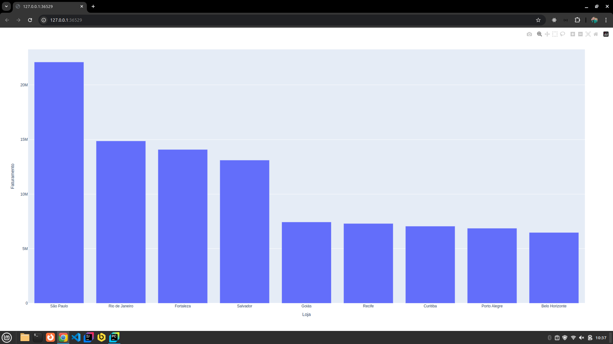

<h1 align="center">Análise de Vendas</h1>

 Análise sobre as vendas de várias lojas em relação a alguns produtos. 

  <a href="#-tecnologias">Tecnologias</a>&nbsp;&nbsp;&nbsp;|&nbsp;&nbsp;&nbsp;
  <a href="#-projeto">Projeto</a>&nbsp;&nbsp;&nbsp;|&nbsp;&nbsp;&nbsp;
  <a href="#-aprendizado">Aprendizado</a>&nbsp;&nbsp;&nbsp;|&nbsp;&nbsp;&nbsp;
  <a href="#-licença">Licença</a>

  

 

  

---
## 🚀 Tecnologias

Esse projeto foi desenvolvido com as seguintes tecnologias:

- Python
- Pandas
- Plotly
- Excel

---
## 💻 Projeto

Projeto de análise de dados, onde foram analisados os dados de vendas e faturamento de 7 produtos (IPhone, Televisão, Notebook, Android, Smartwatch, Tablet, Câmera) de 9 cidades diferentes (São Paulo, Rio de Janeiro, Fortaleza, Salvador, Goiás, Recife, Curitiba, Porto Alegre e Belo Horizonte)

---
## 📑 Aprendizado

Durante esse projeto aprendi: 
- Importar e usar libs utilizando pip
- Importar e ler dados, arquivos externos
- Estruturas de repetição e condicional em python
- Tratar e compilar os dados importados
- Criar gráficos básicos

---
## 📝 Licença

Esse projeto está sob a licença MIT.

---